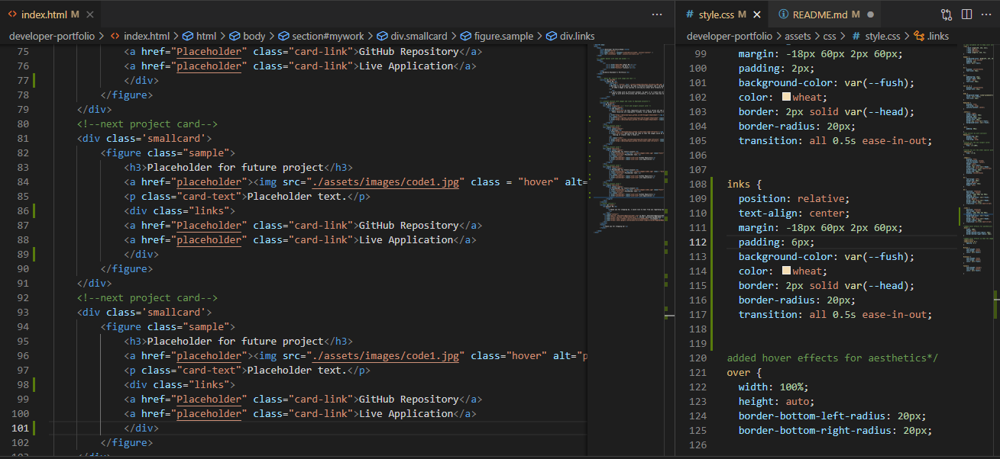

# Title:
* developer-portfolio

# Links:
Live Application: https://mblackwellgca.github.io/initialPortfolio/

Github: https://github.com/mblackwellgca/initialPortfolio 

## Description
* Learning to code and develop webpages using coding to build has opened a new world of seemily limitless posibilities. Please enjoy this compilation of work samples as I explore this new and exciting journey towards becoming a developer!

## Credits:
* Sandra Smith
* Christopher Ponzio https://github.com/ChristopherPonzio
* Website Resources: 
    * https://www.w3schools.com/cssref/sel_root.asp
    * https://developer.mozilla.org/en-US/docs/Web/CSS/display
    * https://css-tricks.com/snippets/css/a-guide-to-flexbox/

## License:
MIT License
